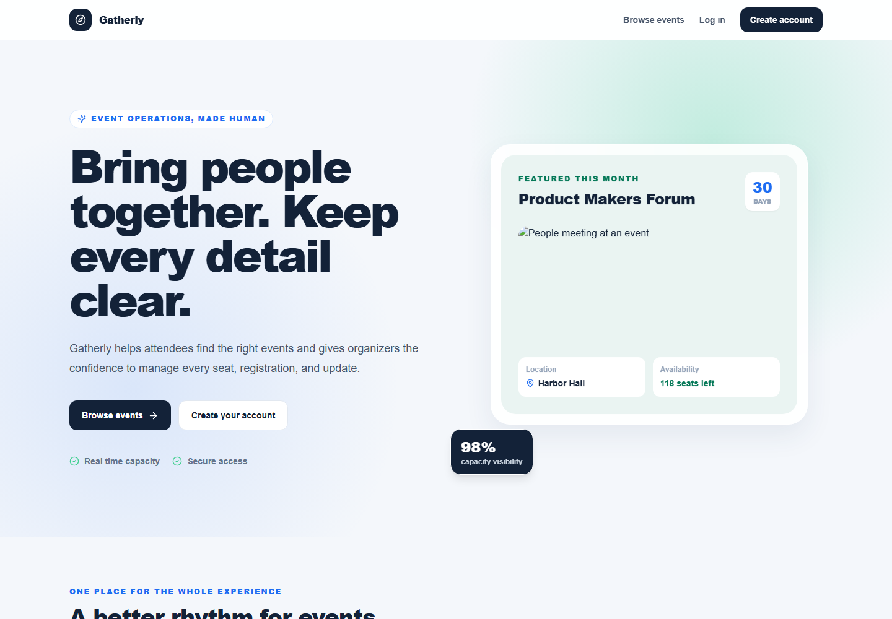
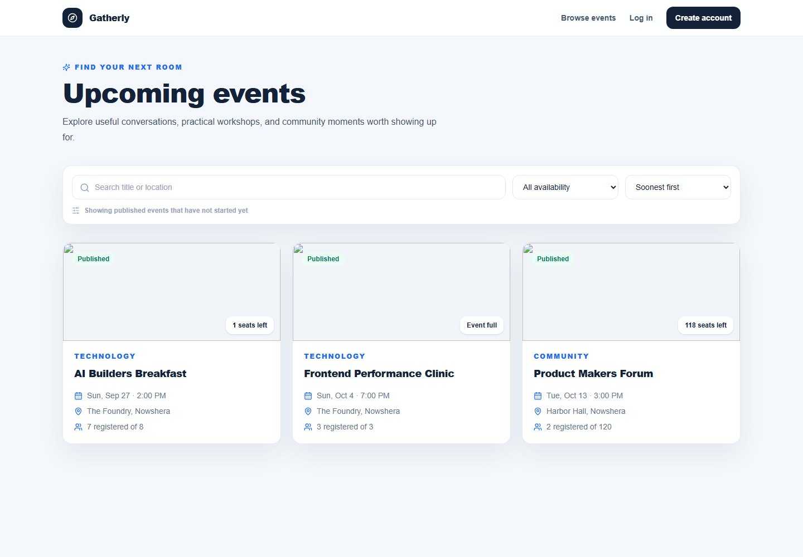
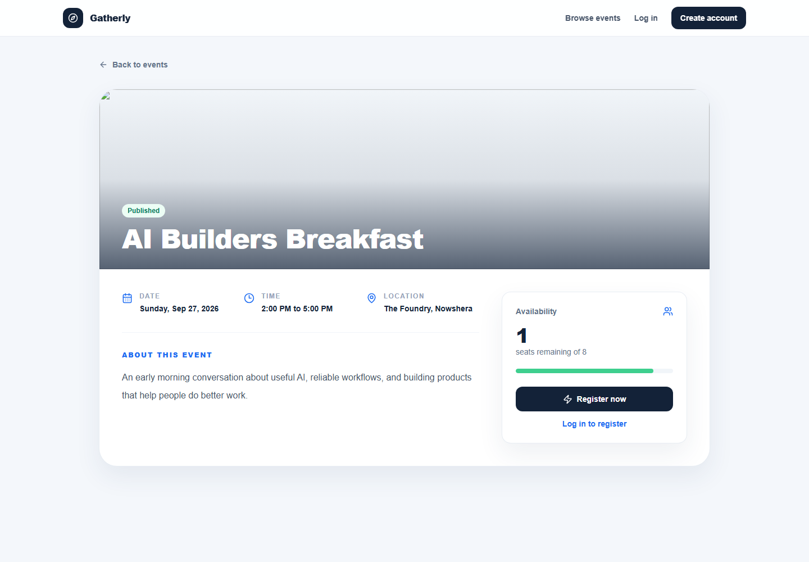
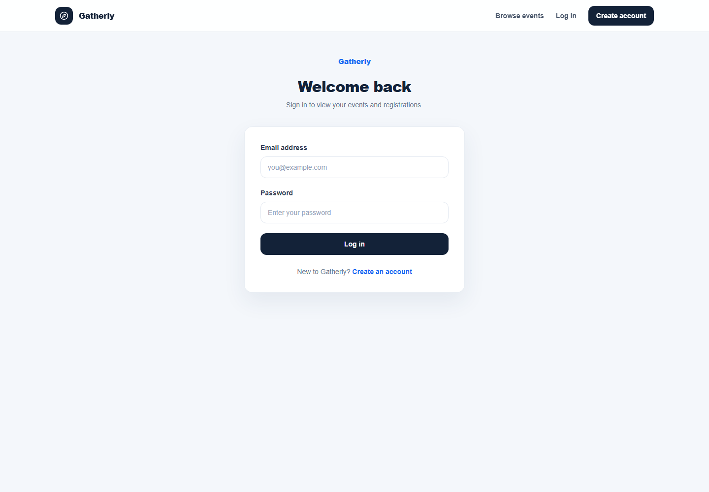
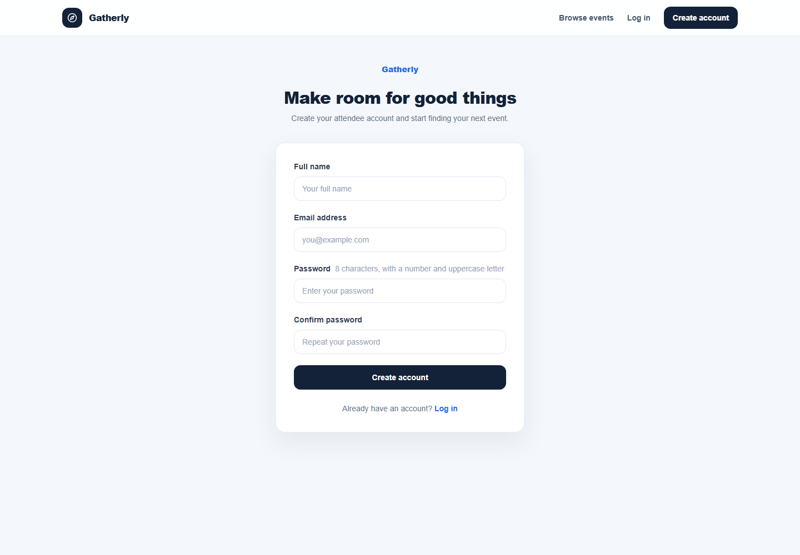
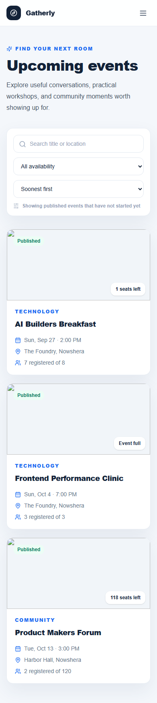
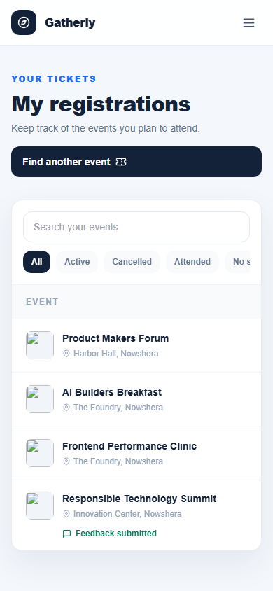
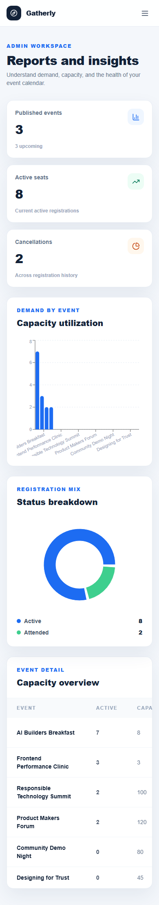

# Gatherly

Gatherly is a complete Event Registration and Management System. Attendees can discover events, save a seat, review their registrations, and manage their profile. Administrators can run the event calendar, publish or cancel events, watch capacity, manage registrations, and review real reports.

## Features

Attendee accounts use secure password hashing and database sessions. Event discovery supports search, availability filters, and sorting. Registration uses a database transaction with an atomic seat reservation and a unique user and event constraint, so the final seat cannot be sold twice. Admin pages use server side role checks, real database statistics, event management, attendee management, and reports.

The project also includes loading states, empty states, friendly errors, toast notices, responsive layouts, accessible labels, and focus states.

## Submission pack

The delivery evidence requested by the project brief is organized in `DELIVERY_CHECKLIST.md`. The database diagram is in `docs/DATABASE_SCHEMA.md`, the feature evidence is in `docs/FEATURE_COMPLETION_CHECKLIST.md`, testing evidence and known limitations are in `docs/TESTING_EVIDENCE.md`, and the final screenshot list is in `docs/SCREENSHOTS.md`.

## Application screenshots

The submission includes real captures of the public attendee journey, authenticated attendee pages, authenticated admin pages, and the database schema. The complete evidence index is in `docs/SCREENSHOTS.md`.

### Public and authentication

### Attendee journey

### Admin journey

### Database

### Mobile responsive evidence

These captures show the same deployed application at a 390px mobile viewport, including the attendee and administrator flows.

## Live deployment

Live application: https://event-registration-management-syste-six.vercel.app

Public GitHub repository: https://github.com/umarakbar6/event-registration-management-system

The live application uses Vercel and a seeded Neon PostgreSQL database. Demo credentials are listed below and are intended for evaluation only.

## Technology

The application uses Next.js, React, TypeScript, Tailwind CSS, Prisma, SQLite for local development, and PostgreSQL support through the alternate schema in `prisma/schema.postgresql.prisma`. It uses Zod for validation, bcryptjs for password hashing, and a small database backed session layer with secure cookies.

## Run locally

Requirements are Node 20 or newer and pnpm.

1. Install packages with `pnpm install`.
2. Copy `.env.example` to `.env` and set a long `AUTH_SECRET`.
3. Generate Prisma Client with `pnpm db:generate`.
4. Create the local database with `pnpm db:push`.
5. Add demo data with `pnpm db:seed`.
6. Start the app with `pnpm dev`.

Open `http://localhost:3000`.

## Demo accounts

These accounts are for local development only.

Admin: `admin@nowshera-events.pk` with password `NowsheraAdmin123!`

Attendee: `ahmad@nowshera-events.pk` with password `NowsheraAttendee123!`

More attendees are created by the seed script. Change or remove these credentials before any shared deployment.

## PostgreSQL setup

The included default schema is SQLite so a fresh developer can run the project without installing another service. For PostgreSQL deployment, copy `prisma/schema.postgresql.prisma` over `prisma/schema.prisma`, set `DATABASE_URL` to the PostgreSQL connection string, and create a fresh initial migration for that new database with `pnpm exec prisma migrate dev --name init`. The checked in migration is for the self contained SQLite development setup, so keep provider specific migration histories separate.

For a shared environment, use `prisma migrate deploy` after creating and reviewing a migration. Never run the seed script against a production database.

## API overview

Authentication uses `POST /api/auth/register`, `POST /api/auth/login`, `POST /api/auth/logout`, `GET /api/auth/csrf`, and `GET /api/me`.

Events use `GET /api/events`, `GET /api/events/:id`, `POST /api/events`, `PATCH /api/events/:id`, `DELETE /api/events/:id`, and `POST /api/events/:id/register`.

Registrations use `GET /api/registrations`, `DELETE /api/registrations/:id`, and `PATCH /api/registrations/:id` for admin status changes. Feedback uses `POST /api/feedback` and is limited to one submission per attendee for an attended event that has ended. Admin reporting uses `GET /api/admin/statistics`. Profile updates use `GET` and `PATCH /api/profile`.

Mutation requests must include the `x-csrf-token` header returned by `GET /api/auth/csrf`. Admin endpoints verify the session role on the server.

## Tests and checks

Run the critical registration rule tests with `pnpm test`. Run the strict TypeScript check with `pnpm typecheck`. Build production output with `pnpm build` and start it with `pnpm start`. Run `pnpm test:record` to execute the complete verification pass and generate individual test evidence in `docs/test-records/latest.md`.

## Security notes

Passwords are never stored directly. Session tokens are random opaque values and only keyed HMAC SHA 256 hashes are stored. Session cookies are HTTP only and same site. Mutations use a double submit CSRF token. Input is validated with Zod. Database access uses Prisma parameters. Attendee queries are scoped to the signed in user, while admin access is checked on the server. Errors returned to the browser are sanitized.

Set `secure` cookies through production HTTPS, use a strong secret, use a managed PostgreSQL service, restrict database access, and configure backups before a public deployment.
