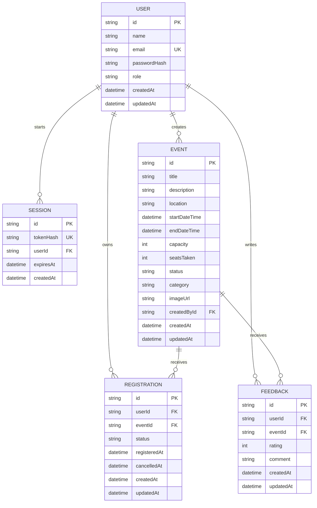

# Gatherly database schema

This is the database evidence for the Event Registration and Management System. The default local database uses SQLite through Prisma. The matching PostgreSQL schema is in `prisma/schema.postgresql.prisma`.

## Relationship diagram

## Integrity controls

1. User email is unique.
2. A user and event pair is unique in Registration. A cancelled registration is reused when the attendee registers again, so only one active record can exist.
3. Registration uses an atomic event update where `seatsTaken` is still below `capacity`.
4. Event capacity is a positive whole number and cannot be reduced below active registrations.
5. Registration and Feedback keep foreign key relationships and timestamps.
6. Sessions cascade when a user is removed. Event history is protected from accidental removal when registrations exist.

